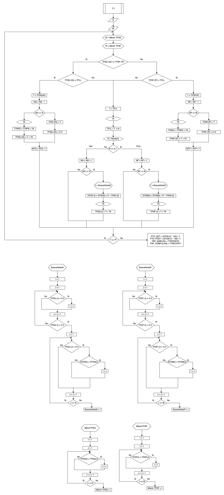

# server-requests-simulation

# Enunciado y Análisis Previo

Se encuentra en el archivo word

# Cálculo FDP

Para calcular las FDP que más se ajustan al IA, TA_Simples y TA_Complejas se debe correr el archivo calculoFDP.ipynb.

Este descomprimirá el archivo con los datos leyéndolo y guardandolo en dataframes.

En estos dataframes se analizarán los datos y calculará las FDP que mejor se ajustan.

# Diagrama

Link: https://drive.google.com/file/d/1emaxuwGTJd_NlK1ID9lAA8_zIEjJOI8f/view?usp=sharing